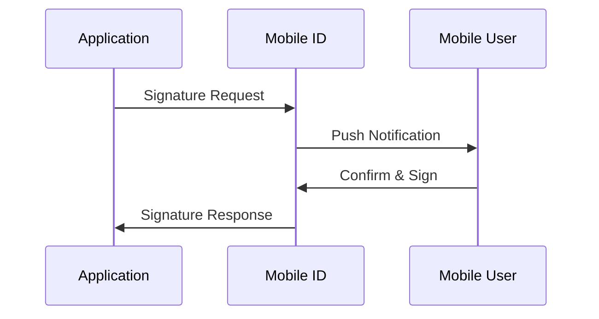
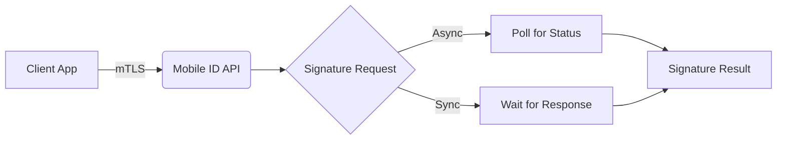

# Mermaid Diagram Support

This page demonstrates the built-in Mermaid diagram rendering. You can use `mermaid` code blocks in any Markdown page.

## Sequence Diagram

```mermaid
sequenceDiagram
    participant App as Application
    participant MID as Mobile ID
    participant User as Mobile User
    App->>MID: Signature Request
    MID->>User: Push Notification
    User->>MID: Confirm & Sign
    MID->>App: Signature Response
```

## Flowchart

```mermaid
flowchart LR
    A[Client App] -->|mTLS| B(Mobile ID API)
    B --> C{Signature Request}
    C -->|Async| D[Poll for Status]
    C -->|Sync| E[Wait for Response]
    D --> F[Signature Result]
    E --> F
```
